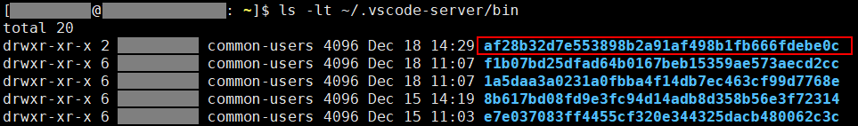

# VSCode

## 离线安装 VSCode Server

vscode自动更新ssh remote插件的服务器部分vscode-server可能会失败，这时可以尝试按下方步骤离线安装服务器上的vscode-server：

1. 登录服务器，输入下方命令，找到自动更新失败的vscode-server版本，`-t`表示按修改时间排序：

    ```sh
    ls -lt ~/.vscode-server/bin
    ```

2. 可以看到`bin`目录下有一组hash code命名的子目录，每个子目录表示一个版本的vscode-server。

    

3. 找到修改时间最新的（第一个）子目录，该目录就是更新失败的vscode-server，里面通常是空的或有一个lock文件。记下目录名称的hash code（af28b32d7e553898b2a91af498b1fb666fdebe0c）。

4. 使用下方链接下载更新失败的vscode-server，\<hash code\>部分替换为记下的hash code。

    ```url
    https://update.code.visualstudio.com/commit:<hash code>/server-linux-x64/stable
    ```

    + 有时访问该链接会发生『访问 update.code.visualstudio.com 被拒绝』错误，可以尝试通过vpn或在服务器上使用wget下载。

    + 若服务器使用非x86-64指令集，需要将server-linux-x64替换为。例如arm64服务器，替换为server-linux-arm64。

5. 将获得的`vscode-server-linux-x64.tar.gz`解压至`~/.vscode-server/bin`目录。

    ```sh
    mv ./vscode-server-linux-x64.tar.gz ~/.vscode-server/bin
    cd ~/.vscode-server/bin
    tar -xzf vscode-server-linux-x64.tar.gz
    ```

6. 删除原来的hash code目录，并将解压得到的目录`vscode-server-linux-x64`重命名为hash code。

    ```sh
    rm -rf <hash code>
    mv vscode-server-linux-x64 <hash code>
    ```

7. 看到hash code目录中有下图所示文件，说明离线安装成功。可打开vscode，尝试使用ssh remote连接服务器。

    

## 启动vscode不保留上次关闭的标签页

1. 文件(F) → 首选项 → 设置。

2. 搜索设置项`Window: Restore Windows`，选择`none`选项。

    
